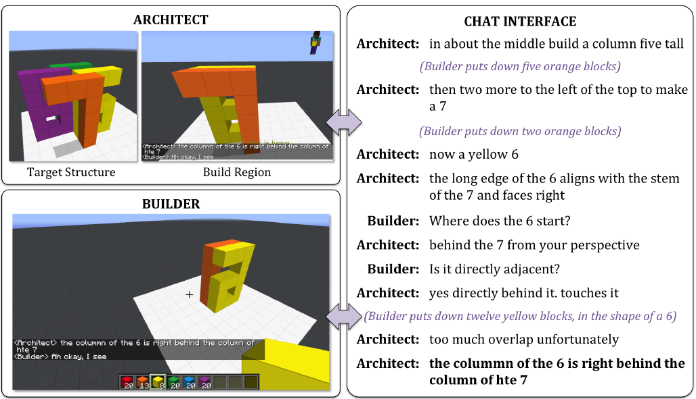

IGLU: Interactive Grounded Language Understanding in Minecraft
==============================================================

.. image:: assets/bell.png
  :scale: 20 %
  :alt:
.. image:: assets/L.png
  :scale: 20 %
  :alt:
.. image:: assets/heart.png
  :scale: 20 %
  :alt:
.. image:: assets/Ls.png
  :scale: 20 %
  :alt:

.. _MineRL: http://minerl.io

.. _gym: https://gym.openai.com/

What is IGLU?
-------------

IGLU is a research project aimed at bridging the gap between reinforcement learning and 
natural language understanding in Minecraft as a collaborative environment. It provides the RL environment where the goal 
of an agent is to build structures within a dedicated zone. The structures are described
by natural language in the game's chat. 

The task represents a cooperative asymmetric task that involves two participants: the architect and the builder.
The architect is provided with a target structure that needs to be built by the builder. 
The architect provides instructions to the builder on how to create the target structure and 
the builder can ask clarifying questions to the architect if an instruction is unclear. 
This dialog happens by means of a chat interface.

We provide the ``iglu`` python package where we implemented the gym_ environment for creation
artificial builder agents. 

We thank creators of MineRL_, as our codebase depends heavily on their project.

.. toctree::
   :caption: Getting started
   :maxdepth: 2

   installation
   envs
   tasks

Package reference
=================

.. toctree::
   :maxdepth: 2
   :caption: IGLU API reference:

   auto/iglu
   auto/iglu.tasks
   auto/modules

Indices and tables
==================

* :ref:`genindex`
* :ref:`modindex`
* :ref:`search`
