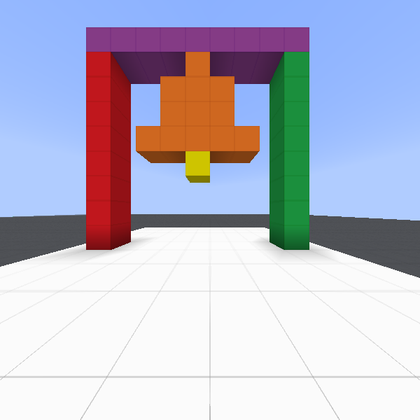
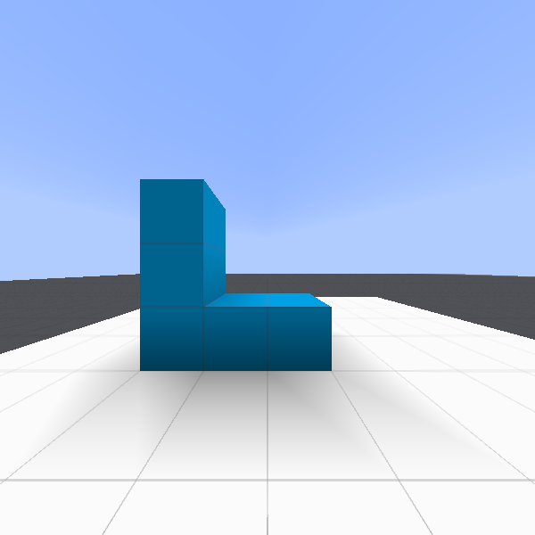
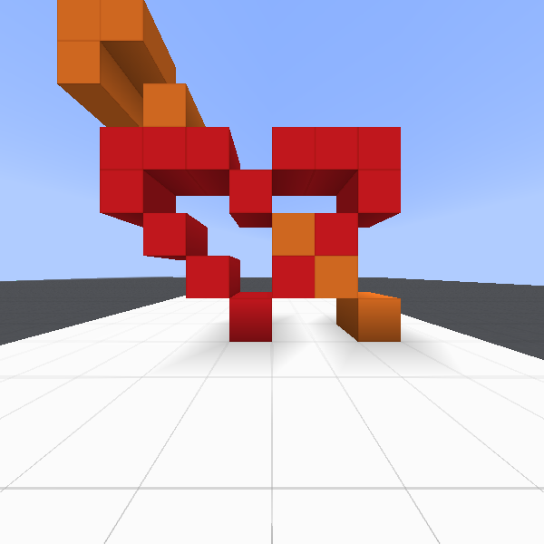
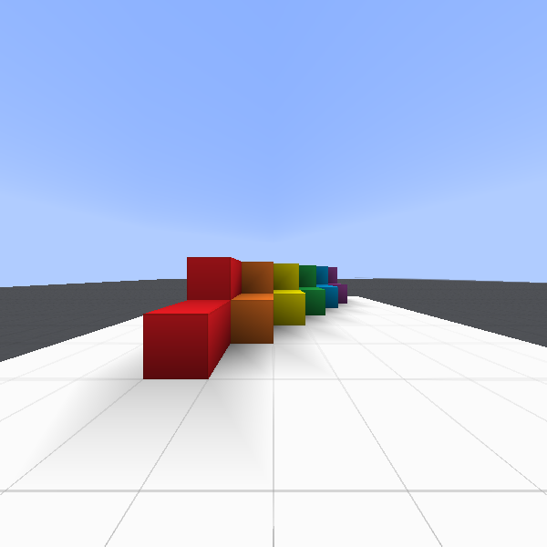

IGLU: Grounded Language Understanding in Minecraft
==================================================

.. _MineRL: http://minerl.io

What is IGLU?
-------------

IGLU is a research project aimed at bridging the gap between reinforcement learning and 
natural language understanding in Minecraft. It provides an RL environment where the goal 
of an agent is to build structures within a dedicated zone. The structures are described
by natural language in the game's chat. 

We thank creators of MineRL_, as our codebase depends heavily on their project.

Getting started
===============

.. code-block:: python

   import gym
   import iglu

   env = gym.make('IGLUSilentBuilder-v0', max_steps=1000)
   obs = env.reset()
   done = False

   while not done:
       action = env.action_space.sample()
       obs, reward, done, info = env.step(action)
       

IGLU Environment
================

IGLUSilentBuilder-v0
--------------------

This environment is part of Silent Builder task of IGLU competition. 
The agent spawns at the center of building zone which is a `11x9x11`
cuboid above blocks which are marked white. Each step the agent gets a pov image,
an inventory state, a position, and the goal information which is described
below. The agent can navigate inside the building zone, select block stack
from the inventory and place/break blocks. The goal of the agent is to build 
the target structure using only the text of the conversation betwen human 
architect and builder taken from the dataset.

Observation space
*****************

Observation space of silent builder consisits of five components

.. code-block:: python
   
   Dict({
       "pov": Box(low=0, high=255, shape=(64, 64, 3)),
       "inventory": Box(low=0, high=20, shape=(6,)),
       "agentPos": Box(low= [-5, 0, -5, 0,  -90], 
                       high=[ 5, 8,  5, 360, 90],
                       shape=(5,)),
       "grid": Box(low=-1, high=5, shape=(9, 11, 11)),
       "chat": String()
   })

First, ``"pov"`` is a ``64x64`` RGB first-person view image of the agent.
In ``"inventory"`` there are stack counts for each of six block stacks: 
`blue, yellow, green, orange, purple, red`. At the start of the episode
`blue` stack is active. The ``"agentPos"`` component is described by `5`
numbers which are `x, y, z` coordinates and `pitch, yaw` angles.
``"grid"`` observation contains block ids of voxel grid captured from the building zone.
Id `-1` coorresponds to `air` block and the rest of them are ordered as in the 
``"inventory"`` observation. Finally, ``"chat"`` represents the conversation between
the architect and the builder acquired from human-human interation which coorresponds
to the current task.

Additionally, the agent has access to target structure of the current task. It is 
stored inside ``info`` dictionary by ``'target_grid'`` key. The representation is the same as 
for ``"grid"`` observation component.

.. warning::

    This observation space will not be used for evaluation in the Silent Builder task
    of the IGLU competition. For evaluation environment see ``IGLUSilentBuilderVisual-v0``

Action space
************

The ``IGLUSilentBuilder-v0`` environment can be customized with three different action spaces. 

Human-level actions: 

.. code-block:: python
   
   Dict({
       "forward": Discrete(2),
       "back": Discrete(2),
       "left": Discrete(2),
       "right": Discrete(2),
       "jump": Discrete(2),
       "attack": Discrete(2),
       "use": Discrete(2),
       "camera": Box(low=-180.0, high=180.0, shape=(2,)),
       "hotbar": Discrete(6),
   })

This action space is the same as that in MineRL_ competition environments except there 
is ``"hotbar"`` selection commands added.

Discrete coordinate actions:

.. code-block:: python
   
   Dict({
       "move": Discrete(3),
       "strafe": Discrete(3),
       "jump": Discrete(2),
       "attack": Discrete(2),
       "use": Discrete(2),
       "camera": Box(low=-180.0, high=180.0, shape=(2,)),
       "hotbar": Discrete(6),
   })

Following these actions, the agent would move over discrete positions
coorresponding to centers of blocks.
For navigation commands (``"move"``, ``"strafe"``), there are 3 options
which coorrespond to no-op, forward, and backward movement (no-op, right, and left in 
case of ``"strafe"``). If ``"jump"`` **action is non-zero alongsize the movement action,
the jump would occur simultaneously with movement (as otherwise the agent would be unable 
to jump upstairs).** Take this into account when designing your action space discretization.

Absolute movement actions:

.. code-block:: python
   
   Dict({
       "move_xyz": Box(low=-1, high=1, shape=(3,)),
       "camera": Box(low=-180.0, high=180.0, shape=(2,)),
       "attack": Discrete(2),
       "use": Discrete(2),
       "hotbar": Discrete(6),
   })

This action space allows agent to fly freely inside the building zone without 
collisions (except with the ground). The rest components of the action space 
are the same as in the previous two spaces.

To select a proper action space, one can simply pass the corresponding argument
to the environment constructor:

.. code-block:: python

   # For human level actions
   env = gym.make('IGLUSilentBuilder-v0', action_space='human-level')
   # For discrete coordinates actions
   env = gym.make('IGLUSilentBuilder-v0', action_space='discrete')
   # For absolute actions
   env = gym.make('IGLUSilentBuilder-v0', action_space='absolute')

The default value is ``'human-level'``.

Tasks
*****

Each episode of the environment is parameterized by the task of the agent. 
Each task is represented by string containing the converation and target structure
encoded into 3d voxel grid. All tasks are sampled from the dataset collected 
in :cite:p:`narayan-chen-collaborative`. Each task has its unique id of the format
``C*``.  On creation, the env loads all tasks from the dataset. Each ``.reset`` samples 
a new task from the current task set and makes it active. 

To load new set of tasks into the environment 

.. code-block:: python

   from iglu.tasks import TaskSet

   env = gym.make('IGLUSilentBuilder-v0')
   env.update_taskset(TaskSet(preset=['C1', 'C2', 'C3']))

Additionally, we provide a different type of tasks for the agent. These tasks are generated randomly.
Here are main parameters of ``RandomTasks`` class. It can be used as drop-in replacement for ``TaskSet``.

.. autoclass:: iglu.tasks.task_set.RandomTasks
   :noindex:

Here is the full list of available goals:

.. exec:: 

   from iglu.tasks.task_set import TaskSet
   ts = TaskSet(preset=[f'C{j}' for j in range(1, 158)], update_task_dict=True)
   print('\n'.join(f'{k}: {v}' for k, v in TaskSet.ALL.items()))

References
**********

.. bibliography::

Package reference
=================

.. toctree::
   :maxdepth: 2
   :caption: Contents:

   auto/iglu
   auto/iglu.tasks
   auto/modules

Indices and tables
==================

* :ref:`genindex`
* :ref:`modindex`
* :ref:`search`
